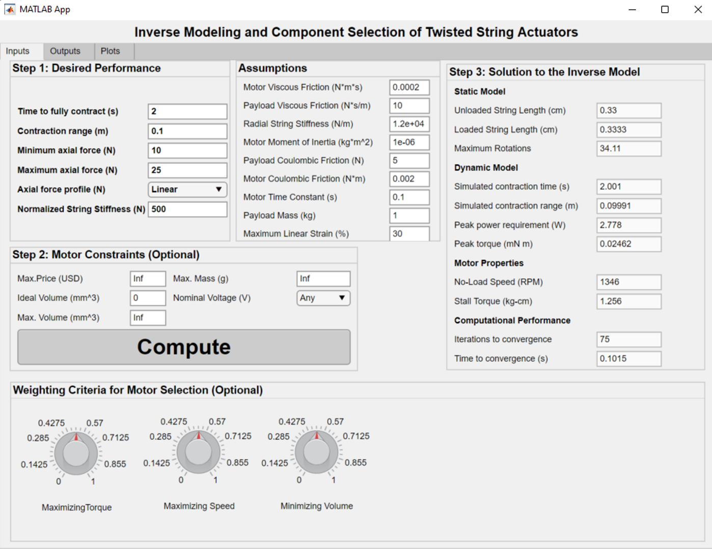
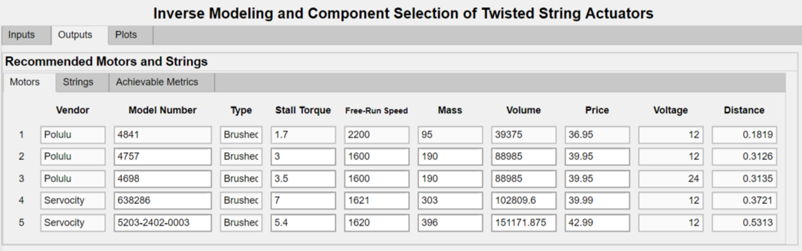
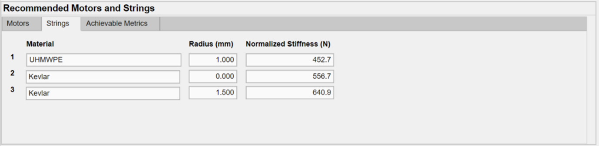
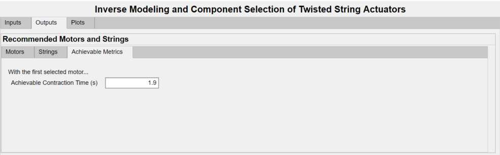
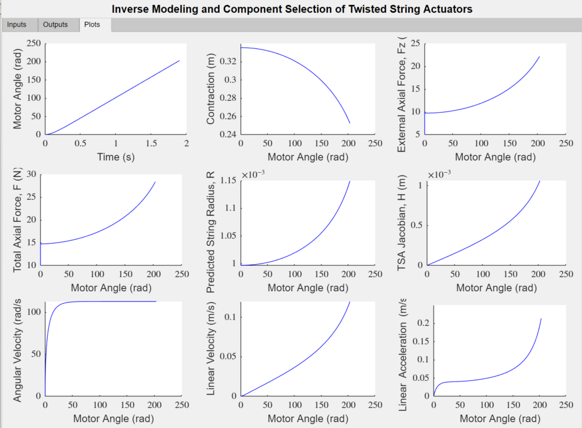

# Inverse Modeling and Component Selection for Twisted String Actuators

Twisted string actuators (TSAs) have exhibited high performance in numerous mechatronic applications. However, in existing literature, the selection of TSA components, namely the strings and motors, is often done through ad hoc procedures and generally not governed by a rigorous mathematical process. In principle, the selection of TSA components would require inversion of the static and dynamic TSA models, which is difficult due to strong nonlinearities and couplings in the variables. In this work, we develop a systematic design framework for TSAs based on the desired performance properties. A graphical user interface (GUI) was created to easily download and use the algorithm.

This algorithm has six *required* inputs:

1. Contraction time (seconds).
2. Contraction range (meters).
3. Minimum axial force (Newtons).
4. Maximum axial force (Newtons).
5. Force profile over the actuation range (linear, parabolic, or randomly varying).
6. String stiffness

There are additionlly several assumptions that may be modified by the user:

1. Motor (rotational) viscous friction.
2. Payload (linear) viscous frction.
3. Radial string stiffness.
4. Motor moment of inertia.
5. Payload mass.
6. Motor (rotational) Coulombic friction.
7. Payload (linear) Coulombic friction.
8. Time constant of the motor's velocity.
9. Maximum linear strain of the TSA.

At this stage, the algorithm chooses a string pair from the [string database](https://github.com/UNR-Smart-Robotics-Lab/TSA-Design-Algorithm-GUI/blob/main/string_database.xlsx). The string is chosen as that whose stiffness is closest to the user's desired stiffness. The algorithm uses the radius of that corresponding string in the following computations. The user can view the stiffness, radius, and material of the selected string.

Next, the algorithm uses the *inverse static model* to compute:

1. Unloaded string length (cm).
2. Loaded string length (cm).
3. Maximum motor angle (revolutions).

Next, the algorithm uses the *inverse dynamic model* to compute:

1. Peak power requirement (Watts).
2. Peak torque (Newton-meters).
3. Simulated contraction time (for verification).
4. Simulated contraction range (for vertification).

During the computation of the inverse dynamic model, the GUI also reports the (1) iterations to convergence and (2) the time to convergence.

After the inverse dynamic model is solved, the top five most suitable motors are recommended to the user from the [motor database](https://github.com/UNR-Smart-Robotics-Lab/TSA-Design-Algorithm-GUI/blob/main/TSADB.xlsx). The user can view qualitative metrics which are the vendor, model number, and type of motor. The user can also view the quantitative metrics of stall torque, free-run speed, mass, volume, price, and voltage. For each motor, the GUI also displays the "distance," which indicates how similar the motor's actual proprties are to the algorithm's computed properties. A lesser distance is better.

Below are screenshots of the GUI:

