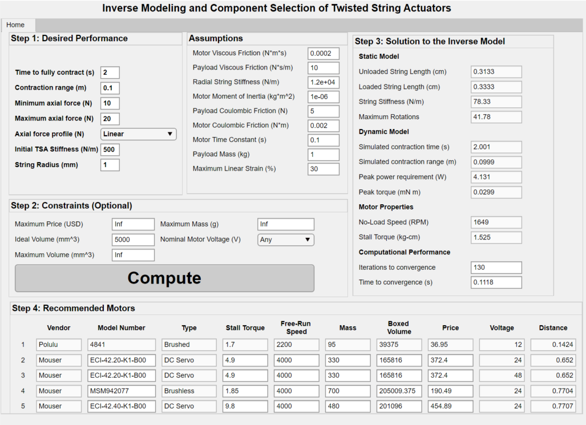

# Inverse Modeling and Component Selection for Twisted String Actuators

Twisted string actuators (TSAs) have exhibited high performance in numerous mechatronic applications. However, in existing literature, the selection of TSA components, namely the strings and motors, is often done through ad hoc procedures and generally not governed by a rigorous mathematical process. In principle, the selection of TSA components would require inversion of the static and dynamic TSA models, which is difficult due to strong nonlinearities and couplings in the variables. In this work, we develop a systematic design framework for TSAs based on the desired performance properties. A graphical user interface (GUI) was created to easily download and use the algorithm.

